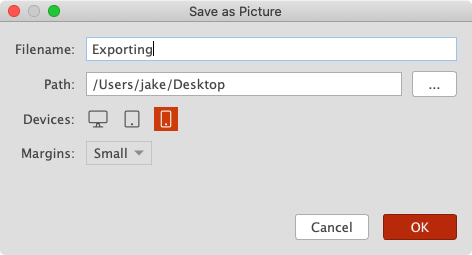
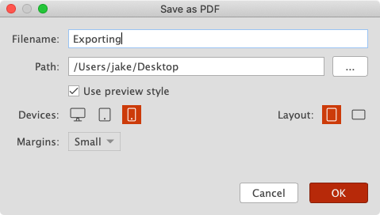
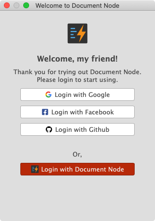

# Version 1.3.1 (stable)

## Exporting Picture for Tablets/Mobiles

If you have ever wanted to generate an article into a single long page of the picture so that you can share and read on mobile devices, here is the good news. You can save a page as a picture easily from the preview page in Document Node.

Choose a target device and set margins, you will get your PDF files immediately. Next time when you want to quickly export a PDF file with the same settings, just press `Command + Shift + P` on macOS (`Ctrl + Shift + P` on Windows and Linux), and then press `Enter` key. It will be done within one second.

## Exporting PDF for Tablets/Mobiles

From this version, it won't be easier to export PDF files to different devices across desktop, tablet, and mobile screens.

Choose a target device, a layout, and set margins, you will get your PDF files immediately. Next time when you want to quickly export a PDF file with the same settings, just press `Command + Shift + S` on macOS (`Ctrl + Shift + S` on Windows and Linux), and then press `Enter` key. It will be done within one second.

In the `Save as PDF` settings dialogue, if you select `Mobile` devices and the total number of pages is less than 20, it will be generated as a single page PDF file, which will be very good for reading on mobile devices.

## Quicker to Rename Files

From time to time, we want to rename a Markdown file to the first heading we write in the text editor or the first dozens of characters of the document content.

This new version can calculate a suggested new file name and put it into the text box automatically, to avoid typing manually.

Press `F2` key to show the `Rename` dialogue, and then press the Enter key, you can rename a file within two seconds.

## Improved the Login Dialogue

To make it easier for new users to log in quickly, we integrated the most popular third-party authentication providers in the software.

Only one-click away to login.

## Miscellaneous Improvements & Fixes

* Fixed issues of restoring backup data
* Improved the accuracy of automatic translations
* Fixed preview issues when task items have sub-lists
* Improved TAB handling by replacing to a TAB character with 4 spaces when opening a document or pasting text into the Markdown editor
* Improved ordered list to increase the number automatically when Enter key is pressed to create a new line
* When users hide tab bar from the `View` menu, always show filename on the Window title bar
* Improved all preview styles
* Fixed issues of restoring custom preview styles from the backup folder