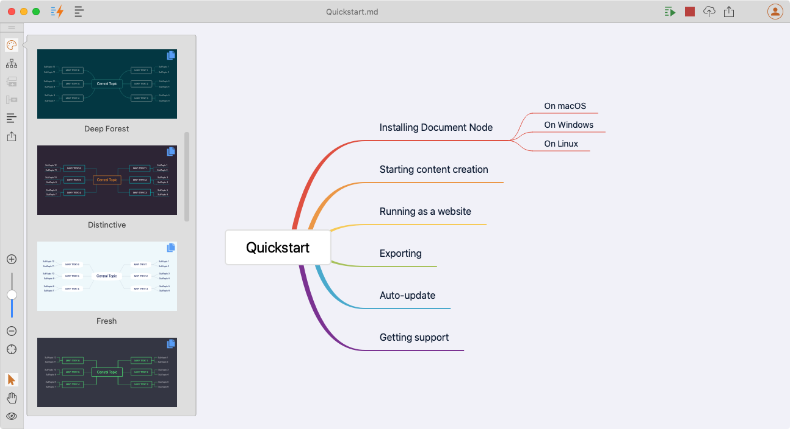

# Version 1.3.10 (stable)

This is a minor version based on version 1.3.9.

## Reduced the price of the Mind Map feature

From this version, the Mind Map feature is available in the "Essential" plan, which is only $3 per month, less than a cup of coffee.

The Mind Map in Document Node is lightweight, cross-platform, beautiful, and customisable, which is different from the majority of other Mind Map software. Unlike other Mind Map applications, we don't have a particular file format for Mind Map, because your Markdown files or rich text documents already contain the logical structure and information. The Mind Map view just presents the logical structure and information you already have. It helps you to restructure your article and review the structure of your article at any time when you want.

As it's implemented in C++, you can see the user experience is much smoother than other Mind Map applications. When you drag the Mind Map node around, it will automatically suggest you where you may want to drop. Once you release your mouse button, the Mind Map is updated, and your document content is updated at the same time.

## Miscellaneous Improvements & Fixes

* Fixed keyboard shortcut issues related to the Polish language
* Removed the confusing "Lock" icon on Mind Map theme thumbnails
