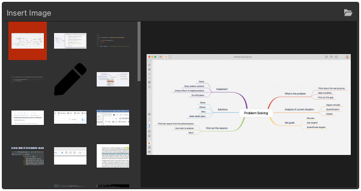

# Version 1.3.11 (stable)

## Improved the image thumbnails popup

To make it easier to preview an image before inserting it into the current document, we added a preview area to the image thumbnails popup.

A bigger preview will be shown on the right side when your mouse is over a thumbnail.

## Improved site generator following SEO best practices

In this version, we've followed a long list of SEO best practices, and make sure Document Node can automatically generate all the information required by search engines. Some of the details are listed below:

* Generate unique and optimal page titles
* Generate unique and optimal page description
* Set image ALT text automatically
* Generate short but accurate URLs for site pages
* Generate canonical URLs
* Generate robots.txt
* Generate sitemap.xml

## Improved security for hosting service

A few security settings have been applied in Document Node hosting service.

* Set MIME types explicitly
* Configured HSTS (HTTP Strict Transport Security) response headers for hosted websites
* Enabled content sniffing protection automatically
* Enabled clickjack protection automatically
* Enabled XSS protection automatically

## Miscellaneous Improvements & Fixes

* Improved the font style of text editor line numbers
* In Editor-only mode, use the same colour of text editor background in the window title bar on macOS
* Don't empty folders in the docs navigation, Table of Contents, and listing page blocks
* Improved text editor performance while typing
* Improved the moving operation by drag-and-drop on the projects tree
* When no documents are open, switch to the document view automatically
* Fixed an issue of detecting the Mind Map central topic
* Improved the image resizing handles in the rich text editor to enable mouse-click on the underlying image
* Removed unnecessary toolbar icons on the preview page
