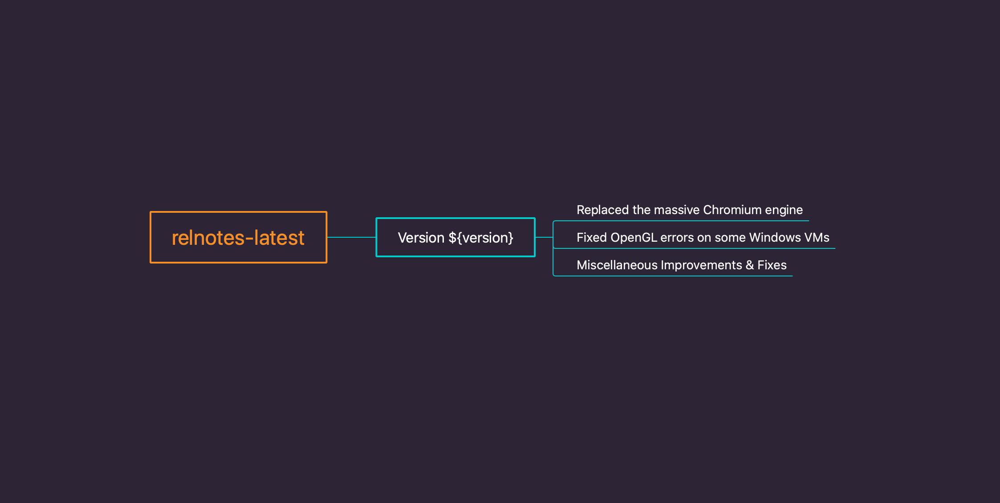

# Version 1.3.12 (stable)

## Replaced the massive Chromium engine

I'm thrilled to let you know that we finally removed the massive Chromium engine and replaced with a lightweight HTML5 rendering engine for preview purpose. We've been looking for a better solution for displaying the HTML5 preview page across all platforms until recently we figured a much better way to do it.

What does that mean? It means Document Node will use much less memory, and will NOT consume significant battery. Moreover, the binary size of the application has been reduced by 60%.

Another good news is that Windows 7 32-bit will have the full functionalities of HTML5 previewing as other platforms. Although Microsoft has stopped supporting Windows 7 from January this year, Document Node can still support it for a little longer.

It's highly recommended that everyone upgrades to the latest version of Document Node to enjoy the benefits of more lightweight application and better performance.

## Fixed OpenGL errors on some Windows VMs

On some Windows VMs where there are no proper OpenGL drivers available, Document Node was not able to be launched. In this version, we have fixed it by enabling a more intelligent way to detect and fall back to a different rendering approach automatically.

This fix should make it more reliable over a broader range of Windows machines as well. Windows users are encouraged to upgrade to this version as soon as possible.

## Miscellaneous Improvements & Fixes

* Fixed OpenGL errors happened on some Windows virtual machines which don't have proper OpenGL drivers
* Fixed an issue that the app sometimes crashes when dragging the central topic of a Mind Map
