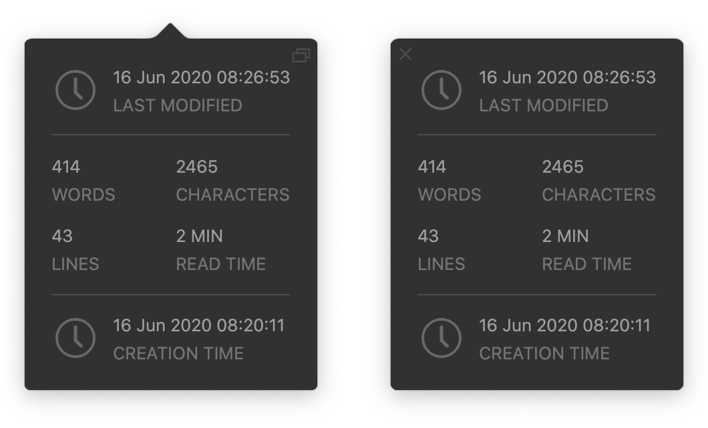
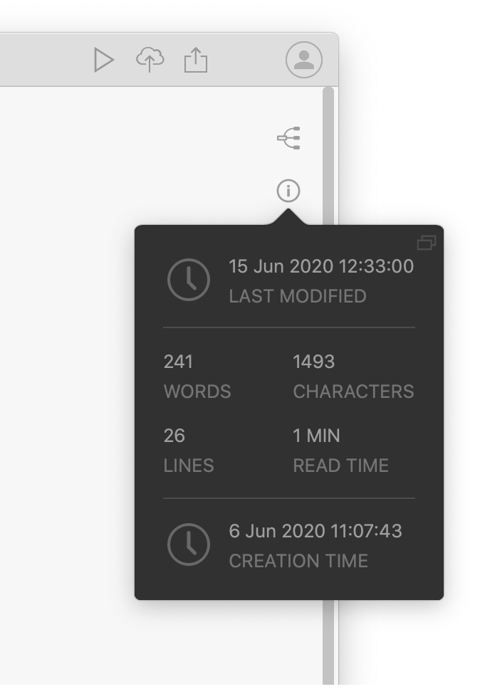
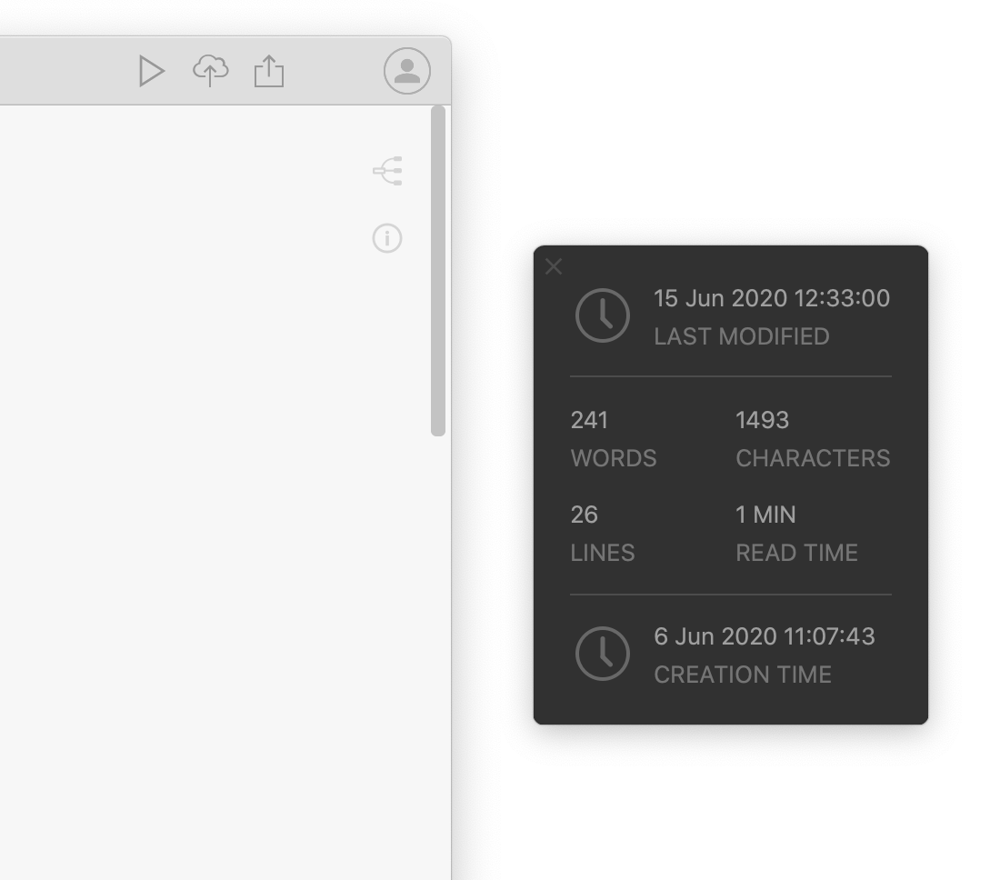
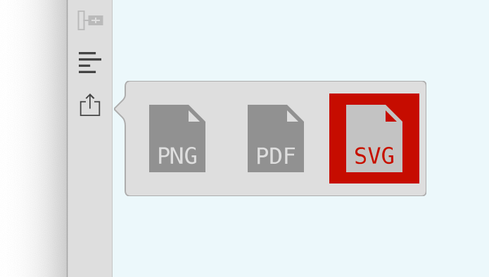

# Version 1.3.13 (stable)

We continued polishing the user experience of Docment Node to make it better every day. If you spot any issues or have any ideas, please don't hesitate to let us know.

## Made the Deletion Operations More Secure

If we change our mind after we delete some files or folders in Document Node, it'd be nice to be able to revert the deletion.

In this version, we improved Document Node so that it will only move the files or folders to the trash instead of deleting directly and permanently. In case we need, we can find the deleted files or folders from the trash bin.

Please note that on Ubuntu or other Linux machines, the deleted files and folders will be moved to `~/.Trash/files` directory.

## Improved the Document Information Popup

Instead of showing the document information in a modal dialogue, we improved it in this version by using a more beautiful popup, where it displays more information including the last modified time, creation time, and the read time. The popup will disappear if you click elsewhere.

If you click the top-right icon, the popup will be made floating and always on top, then you can drag it around in your screen.

It's helpful when you are writing towards a certain number of words in your document, as you can have the statistics popup alongside your text editor.

## Created a New Mind Map Exporting Popup

We also created a new Mind Map exporting popup to replace the old context menu.

## Miscellaneous Improvements & Fixes

* Fixed a cursor colour issue in Typewriter focus mode
* When changing the "`Highlight current line`" setting in `Preferences` dialogue, the text editor should update accordingly
* Fixed wrong cursor shapes sometimes happened outside of the text editor
* Fixed text editor jumping issues when we perform Undo/Redo actions
* Improved syntax highlighting performance for Markdown editor
* Clicking on external links on the preview page should open in the default web browser
* Hide the top right icons ("Mind Map" icon and "Doc Info" icon) in the document editing dialogue in the Mind Map view
* Fixed an issue that folders in breadcrumbs of the generated couldn't be shown
