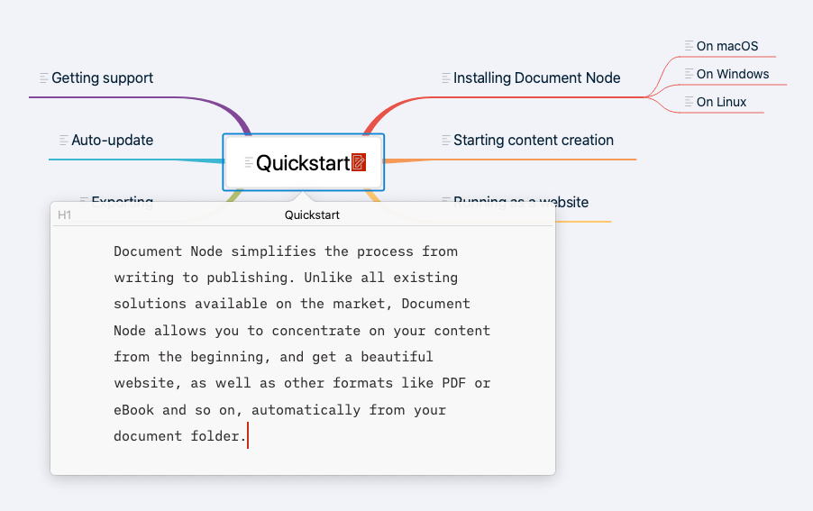

# Version 1.3.14 (stable)

In this version, our focus was still on the stability of Document Node. We fixed some annoying issues and improved the writing experience significantly.

## No more jumping on the preview area

It was annoying that the preview area was sometimes jumping up and down while we were typing in the text editor. It will not happen again as we have fixed it in this version.

Most times, the text editor and the preview area will stay still unless we scroll the text editor using the mouse wheel or the text cursor goes outside of the sight. This removes all the distractions and allows us to concentrate.

## Moving tabs via drag-and-drop

It's a common requirement to move an editor tab via drag-and-drop. We have added the feature in this version, and now it's easy to move a tab to a different position by dragging and dropping it.

## Improvements on Usability of Mind Map

In this version, we improved the usability of the Mind Map significantly. When clicking on a Mind Map node, a popup will be shown to only edit the section content of the Mind Map node.

Any changes to the section content will be applied to the document automatically. New headings can be added to the section content as well, which will be updated to the Mind Map view when the editing popup is hidden.

Additionally, many other Mind Map related problems have been fixed, as listed below.

* Fixed issue to keep the Mind Map view still when we undo/redo the changes
* Fixed a wrong dragging indicator line sometimes happened in Mind Map view
* Fixed issues when editing Mind Map nodes text
* When clicking the editing icon on a Mind Map item it should be automatically marked as selected
* Fixed issues of Undo/Redo in the editing popup
* Fixed Cut/Copy/Paste issues across different editing popups
* Added a keyboard shortcut to hide the editing popup by pressing the `ESC` key
* Changed the keyboard shortcut to switch between the document view and Mind Map view to the same one: `Cmd+Shift+Enter` (`Ctrl+Shift+Enter` on Windows and Linux)
* When scrolling to a heading by clicking an outline item or a Mind Map node, put the text cursor to the end of the heading text instead of the beginning of the heading text

## Miscellaneous Improvements & Fixes

* Fixed translation issues on the Document Information popup
* Fixed preview style issues when the first time we open the application
* Removed the gaps at the top and bottom of the preview page scroll bar
* Improved the performance of re-highlighting a big Markdown file
* Press `ESC` key to close the *Document Information* popup if it's not floating
* Added *File Size* to the *Document Information* popup
* Fixed display issues on the Find/Replace panel
