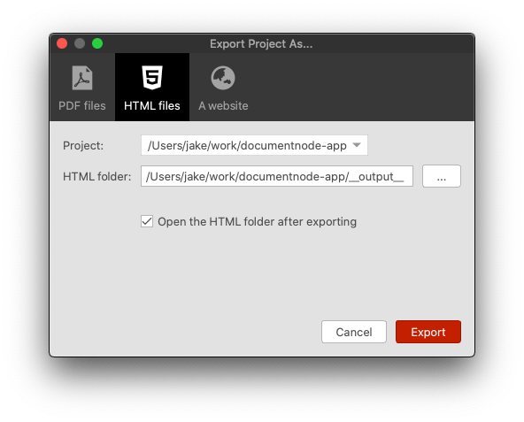
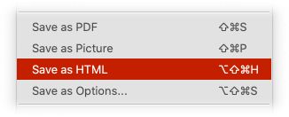
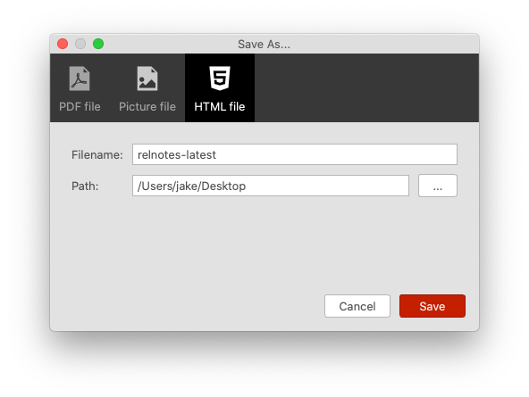

# Version 1.3.15 (stable)

## Exporting HTML files

Sometimes it's handy to export a document as an HTML file with all related resources embedded. When you share this kind of HTML files to others, they can be viewed directly with the beautiful style you set in the preview area.

In this version, we implemented it as one of the exporting features.

Each document in the selected project (Markdown or Rich Text) will be generated to a single HTML file accordingly.

As you can see from the screenshot above, we also integrated different exporting functions into one dialogue, which make it much easier to explore and configure different exporting options.

## Save as HTML file

Similarly, we could save the current document as an HTML file, which will have all resource embedded. Right-click on the preview area and select `Save as HTML`, we can generate an HTML file right away.

Or, select `Save as Options...`, and then we can change a few options before saving the document as an HTML file.

This new dialogue integrates multiple 'Save as' options together, which will be handier to use. Gradually, we will add more output formats to this dialogue.

## Miscellaneous Improvements & Fixes

* Fixed the title text colour issue of the Mind Map section editing popup in dark mode
* Fixed the background colour issue of the combo box widget
* Fixed the image display issues in preview area due to wrong per cent encoding
* Fixed a crashing issue when displaying JPG images in the preview area
* Fixed the main window display issue when taking screenshots from the text editor
* Improved the stability of the login process
* Show warning to users when they try to create a level-7 heading in the Mind Map view, as a document can only have up to six levels of headings
