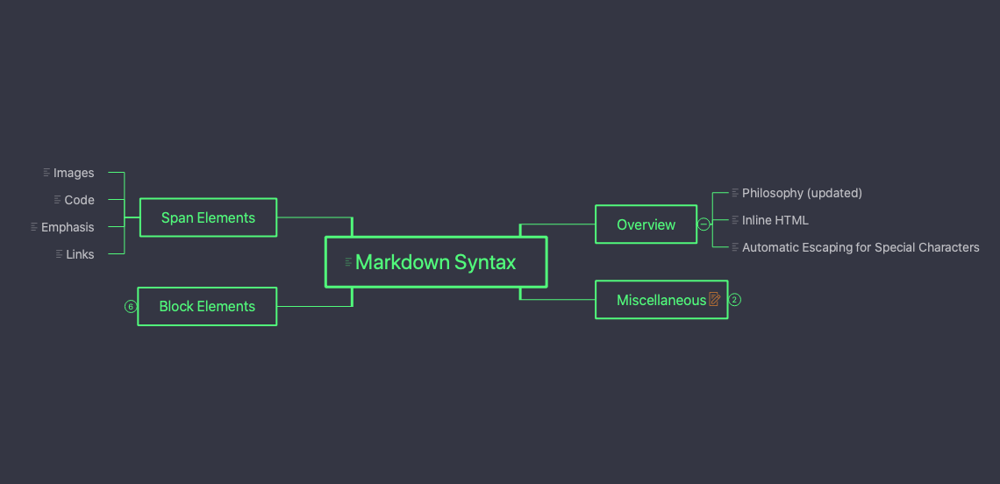
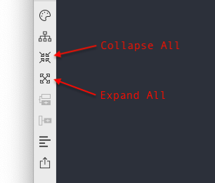

# Version 1.3.16 (stable)

## Expanding and Collapsing Mind Map Nodes

One of the users shared incredible insight regarding Mind Maps with us.

> With a collapsible tree structure, Mind Maps provided by Document Node can be so much more than just a writing tool. They could be a great presentation tool too.
> 
> With the ability to collapse the sibling and child topics, you can guide the audience through your thought process. Slowly revealing the Mind Map builds excitement while also leaving a trail of breadcrumbs to remind attendees how the process evolved and what conclusions were drawn. The presenter can also quickly enter audience comments, and other people get the enjoyment of seeing their ideas absorbed into a growing tree.

We followed the user's voice and implemented the collapsible Mind Map structure in Document Node. Except for the central topic, all children of the main topics and subtopics can be collapsed and expanded as needed.

The collapsible states of each document are remembered, even when we restart the application.

It's also quick and easy to collapse or expand all Mind Map nodes from the two newly added toolbar buttons, as shown in the screenshot above.

## Miscellaneous Improvements & Fixes

* In Mind Map view, we improved the drawing of lines from the central topic in upward and downward layouts
* Fixed an issue of opening PDF files when clicking the links in the preview area
* Fixed an issue that pressing the Shift key when the text cursor is outside the viewpoint should not scroll the cursor to the middle of the view automatically
* When clicking a document link on the preview page, open it in the text editor
* Fixed an issue that copying text from a web page and pasting into Document Node should keep the line breaks
* When there is no scroll bar in the text editor, and the preview area has a scroll bar, the preview should stay in the scroll position users set
* When using arrow keys to select images on the image thumbnails popup, the preview area should be updated at the same time
