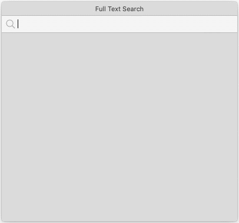
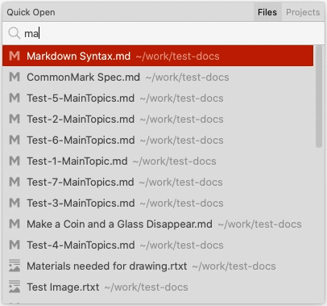
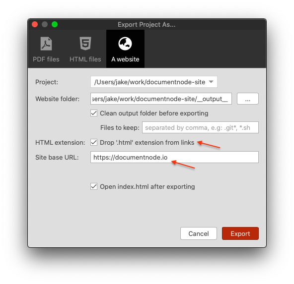

# Version 1.3.17 (stable)

> It's **required to upgrade to this version** to login and enable advanced features, as the server-side endpoints have had a major upgrade. Old versions will soon be unable to login and enable advanced features.

## Full-text Search

When you have more projects and documents, you will often need to find a specific document quickly by searching. Full-text search is a fundamental feature of any content management software.

From this version, the full-text search feature is available in Document Node. Any projects (aka top-level document folders) opened in Document Node will be indexed and searchable automatically.

Click the `Search` icon on the top toolbar, or press `Cmd + Shift + F` (`Ctrl + Shift + F` for Windows and Linux), a full text search popup will appear. Type keywords to search your content, and press the `Enter` key or click the selected row to open the document.

You can also use the `Up` and `Down` arrow keys to select a different row from the result list.

All languages, including CJK (Chinese, Japanese, and Korean) are all supported.

## Quick Open

While you can navigate the folders and files tree structure on the left side, it's convenient to quickly open any previous files or projects by searching the file name.

Select the menu `File` -> `Quick Open` or press `Cmd + O` (`Ctrl + O` for Windows and Linux), the `Quick Open` popup will appear, from which it lists the recent documents initially. You can type keywords to search documents by file name.

Type keywords to search your content, and press the `Enter` key or click the selected row to open the document. The `Up` and `Down` arrow keys can be used to select a different row from the result list.

Additionally, in this version, we removed the "Open Project List" menu and dialogue, as the function has been merged into the `Quick Open` popup.

## New Options for Exporting Websites

Two new options have been added to the "Export Project As Website" dialogue.

* **HTML extension:** We can choose to drop the '.html' extension from links which will be useful for uploading to a hosting service that supports clean URLs
* **Site base URL:** This is used for generating the 'sitemap.xml' and 'robots.txt' files

## Miscellaneous Improvements & Fixes

* Improved the scroll bar of the text editor to be more responsive
* Fixed a responsive issue in the text editor
* Improved API endpoints
