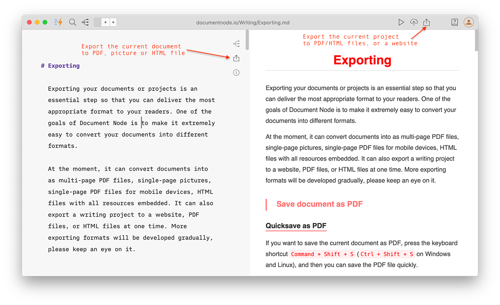

# Version 1.3.18 (stable)

## Progress Message Popup

Previously, the progress message bar is shown on the bottom right status bar, which is not apparent to new users. They may not notice what is happening after clicking the "Run" button.

To eliminate the confusion, we added a progress message popup that shows in the centre of the main window.

It can be hidden when we click the "Minimize" button on the top right corner.

## New 'Save As' Icon in Text Editor

In Document Node, you can save the current document as a PDF/HTML/picture file, and you can also export the current project as PDF/HTML files or a website.

In this version, we added a new 'Save As' icon on the top right corner of the text editor, so it will be easier to access the 'Save As' functionalities. 

## Miscellaneous Improvements & Fixes

* Fixed issues when inputting fenced code blocks in Mind Map section editor
* When more file buttons appear on the bottom bar, close file buttons automatically without resizing the main window
* Fixed an app-crashing issue when clicking the "Outline" icon if no documents are open
* Show "No document outline" message on the "Outline" panel if no documents open
* Added a "Tutorial" button on the toolbar, and we will gradually integrate comprehensive tutorials
* Always show the relative path of the current document as the window title
* Renamed "New Document" to "New File" to allow more file types to be created soon
* Improved the layout of the 'New File' and 'New Folder' dialogues slightly
* Changed slogan from 'Open Document Node, Inspiration Unfold' to 'Writing & Website Publishing Made Easy.'
* Fixed issues of dragging and dropping images from the projects tree to the text editor
* Fixed issues of focus mode switching
* Improved the selection colors of the left panel
* Fixed issues of suggesting a file name when saving a document as PDF/HTML if the preview panel is not shown
