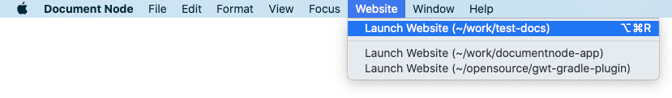

# Version 1.3.19 (stable)

Today's release is a minor version that makes the current version more stable. It only contains several improvements and fixes. Please see the details below.

The next major release is under development and will be available in a few months.

## Renamed 'Run' Menu to 'Website'

In Document Node, a website can be generated from a documents folder automatically, which was called 'Run' a project.

To make it more straightforward, we renamed the menu to 'Website', and sub-menu items to 'Launch Website', 'Open Website' (if already launched), and 'Stop Website' accordingly.

## Miscellaneous Improvements & Fixes

* When the 'Stop' button shows or hides on Windows and Linux, the top right toolbar should be adjusted automatically
* Fixed the theme issues of toolbar buttons on the project exporting dialogue
* Fixed text colour issues on project nodes when they are selected but not focused
* Improved the project tree selection colours of the built-in light appearance
* Fixed a search icon colour issue on the top bar
* Added a 'Clear' icon to the search boxes of 'Quick Open' and 'Full-text Search' popup
* Improved the style of input text dialogues
* Fixed an issue when creating a new Mind Map theme by copying an existing one
* Fixed the progress bar background issue in the popup
* Fixed border colour issues of the left side toolbar icons
