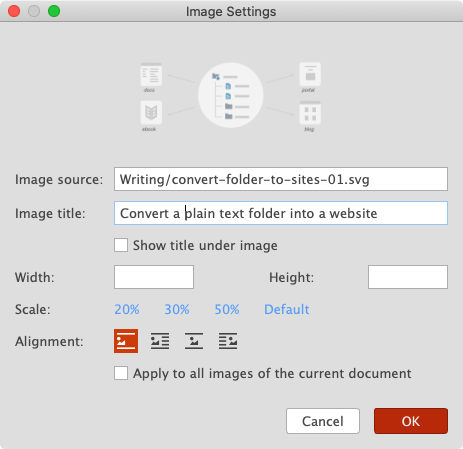

# Version 1.3.2 (stable)

Good news! We just adjusted the pricing of the `Essential` plan to as low as **$3 per month**, billed annually (or $5 per month, billed monthly).

If you don't need to build and publish websites, then the `Essential` plan is perfect for your productive writing and sharing. Now it's also highly customizable! What are you waiting for?

The `Essential` plan includes both the Markdown editor and rich text editor, Mind Map editing, Markdown table editing, auto-complete, quick image settings, taking screenshots, focus mode, multiple projects. You can use all the application appearances and built-in preview styles. You can also export your documents as PDF files and pictures.

Additionally, everything can be customized. The application appearance can be customized in JSON, and the preview style can be customized in CSS, and the Mind Map themes can be customized in JSON.

## Improved the Image Settings

In this version,  we added two more options to the `Image Settings` dialogue - `Scale` and `Apply to all images of the current document`. When you select the `Apply to all...` checkbox, all images in the current document will be updated with the same settings in a batch.

Although you can edit the image properties directly in the Markdown text editor following the extended image syntax,
this `Image Settings` dialogue makes it easier to edit the image properties, with just a few clicks.

## Miscellaneous Improvements & Fixes

* Improved sizes of all dialogues
* Fixed a few issues of page blocks