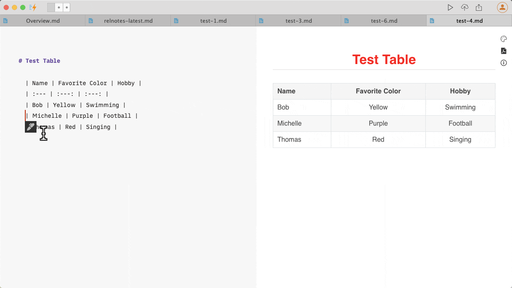
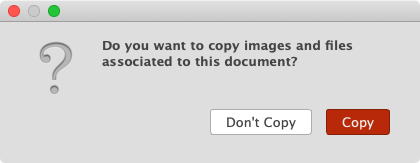
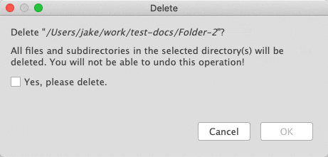
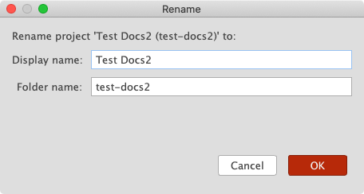
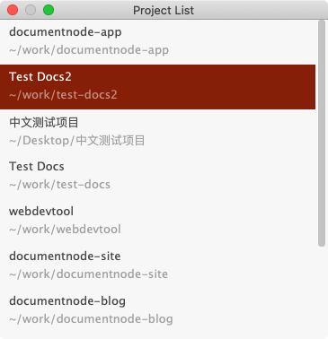
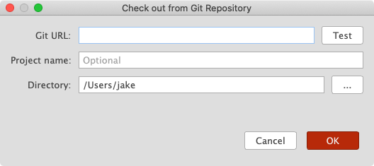

# Version 1.3.3 (stable)

## Convenient Table Editing

The intention of Markdown is to minimise the formatting burden while writing and keep the content as plaintext for easy to read and share. But, when it comes to tables, things are a bit embarrassing.

In nature, tables are structured into rows and columns and heavily depend on the format to visually present the data. It's hard to manage in plain text. Perhaps that's the reason why the [core CommonMark specification](https://spec.commonmark.org/current/) doesn't include tables at all.

The [GitHub Flavored Markdown](https://github.github.com/gfm/) introduced the Tables extension, but you will find it still hard to write a complex table merely in plaintext.

To combine the convenience of both sides, that is, to make it super easy to edit a Markdown table, we developed an Excel-like user interface, where we can edit tables flexibly.

Once we click the "OK" button, Markdown text will be generated and put into the text editor automatically.

## Update Links When Moving Documents

Imagine you have a Markdown (or RichText) document, which has a few local images inserted. If you move the document file to a different folder, you may find that the pictures cannot be displayed correctly in the preview area any more. That's because the relative image paths haven't been updated in your document.

In this version, we improved the software to update all the resource links automatically when you move documents to a different folder or project. If you are moving or copying documents to a different project, you will be asked whether you want to copy the images and files associated with the documents.

Just one less thing to worry about by Document Node users.

## More Secure When Deleting Folders/Files

To avoid accidentally deleting folders or files because we press `Enter` too fast in a `Delete` dialogue, we added a checkbox in it.

Only after we click `Yes, please delete.`, the `OK` button will be enabled. Yes, we are making it harder to delete files! But more secure!

## Improvements on Projects

The project name doesn't have to be the same as the project folder name. From this version, we can give it a separate `Display name` when we rename a project.

To avoid confusions, we renamed the menu:

* `File` -> `Open Project` to `Open Folder as Project`
* `File` -> `New Project` to `Create Empty Project` (because existing document folders can be opened as projects directly)

We also added a new menu item `File` -> `Open Project List` to open a `Project List` dialogue, where we can quickly open any projects that we have created or opened before.

When we checkout a document project from a Git repository, we can specify an `optional` project name as well.

## Miscellaneous Improvements & Fixes

* When dropping files into the Markdown text editor, don't create new files if they already exist
* Fixed issues of Percent Encoding in `Image Settings` dialogue
* Improved the logic of differences calculation when publishing
* Fixed issues when switching the selected lines among `Unordered List`, `Ordered List`, `Blockquote`, and `Task List`.
* Added new items: `Unordered List`, `Ordered List`, and `Task List` to the context menu of Markdown editor
* Improved when to show inline format menu items and when to show paragraph format menu items in the Markdown editor