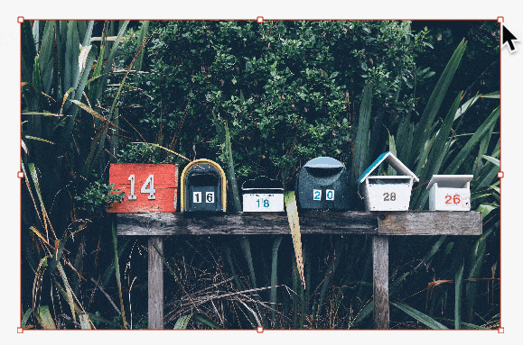
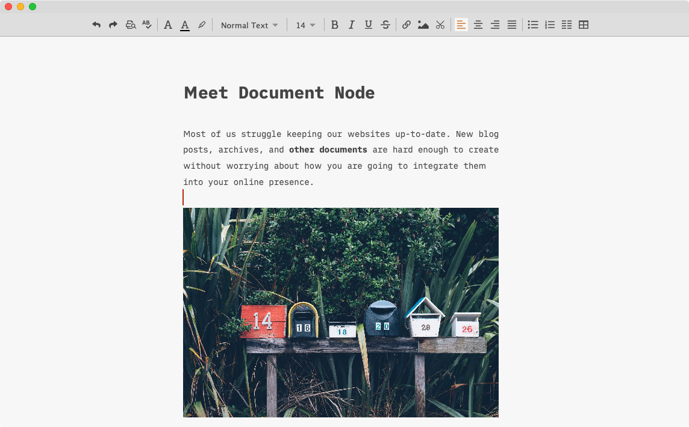

# Version 1.3.4 (stable)

## Decent and Elegant Mind Map View

In this version, we improved the Mind Map view so that it can assist your writing whenever you need. It leverages the entire workspace, to eliminate any distractions.

You can switch between the **Mind Map** view and **Document view** by clicking the toolbar toggle button, or using the keyboard shortcuts:

* Go to Mind Map View (`Cmd+Shift+M` on macOS, `Ctrl+Shift+M` on Windows and Linux)
* Go to Document View (`Cmd+Shift+Return` on macOS, `Ctrl+Shift+Return` on Windows and Linux)

The Mind Map view is supported for both the Markdown and Rich Text documents. We will share more details in blog posts in a few days, please check your inbox then.

## Seamless Workflow of Taking Screenshots

When writing documentation or tutorials, taking screenshots and inserting into a document is a frequent task. Usually, we need to have a separate tool to take the screenshot, and then add the image into the document manually.

In this version, we've implemented a new function which allows you to take a screenshot and insert into your document automatically.

From the Rich Text editor toolbar, click the "**Screenshot**" icon to start taking a screenshot.

When taking a screenshot, we can accurately see which pixel we are on from a small preview popup.

Once a region is selected, double-click the selected area or click the "**OK**" button to insert the screenshot picture into your document.

Another good news is that the same function is available for the Markdown editor, and across all desktop platforms.

## Resizing Rich Text Images via Mouse Dragging

In a decent Rich Text editor, people usually expect that they could resize an image via mouse dragging. From this version, it's possible in Document Node.

Select an image, and drag the corners or edges to resize it. If you hold on the `Shift` key, the aspect ratio of the image will be kept.

## Improved Rich Text Toolbar and Outline

We also improved the layout of the Rich Text editor toolbar.

When resizing the rich text editor, the overflown toolbar buttons will be hidden automatically and will be available in a popup when we click the "More" button.

We also added an outline view of the rich text editor. From the outline tree, we can quickly restructure the document sections via drag-and-drop.

## Added Markdown Table Auto-Padding

If the maximum content length of a Markdown table row is less than 80, the table cells will be automatically formatted with padding.

## Miscellaneous Improvements & Fixes

* Fixed the color issue of progress message on the bottom bar on Dark mode
* Updated link texts to "**Create empty projects**" and "Open folder as project..." on the welcome page
* Fixed issues when parsing special characters in Markdown
* Fixed Copy/Paste issues in the RichText editor
* Fixed drag-and-drop problems on Markdown outline
* Fixed outline headings parsing issues when there are '#' style comments
* Fixed single-click and double-click issues on the left-side
* Default editor font point size to 10 on Windows, 11 on Linux, and 14 on macOS
* Added progress message to the splash screen
* Fixed the problem of not being able to remember the last opened files on app restart
* Improved native window toolbar on macOS
* Changed combo box of file types on the New Document dialogue to radio boxes
* Fixed "per cent encoding" issues when image properties are changed from the dialogue
* Fixed style issues of preview toolbar icons on Windows
* If the file name of new document or folder contains '/', it will be automatically converted to '_' character
* Fixed an intermittently crashing issue when we open the print preview dialogue in the Rich Text editor
* Fixed a scroll bar style issue of the image inserting popup on Windows