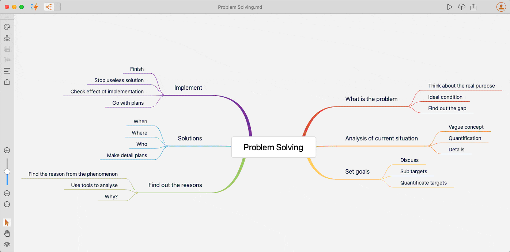
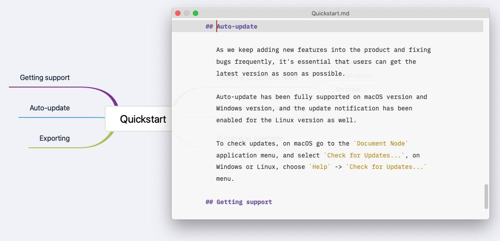
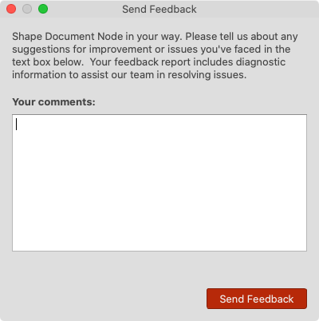

# Version 1.3.7 (stable)

## Reorder Mind Map via Drag-and-drop

From this version, we will be able to drag and drop nodes around in a Mind Map. 

It becomes so easy to change the structure of a document, no matter whether it's a Markdown or Rich Text file because both formats can have a beautiful Mind Map view.

## Document Editor Popup in Mind Map

It would be super convenient if we could edit the corresponding document section of a Mind Map node. Now in this version, the dream comes true.

When we click the "**Edit**" icon of a Mind Map node, a document editor popup will be shown, and the document section is presented to you for editing.

If we click anywhere in the Mind Map view, the document editor popup will disappear automatically.

As we know, both the Markdown files and Rich Text documents can have Mind Map views, which means, if the current document is a Markdown, the document editor popup will be a fully functional Markdown editor. Or, a Rich Text editor will be included in the popup.

## Other Mind Map Improvements

We also improved the Mind Map view in many other aspects.

* Added Undo/Redo support in Mind Map view
* Don't show 'Delete' confirmation dialogue in Mind Map view anymore, as we are now able to use Undo/Redo
* Use arrow keys (Left, Right, Up and Down) to navigate between Mind Map nodes
* Hold on "**Space**" key to drag the Mind Map canvas around
* Fixed the issue of creating children on the central topic using "**Tab**" key

## Built-in 'Send Feedback' Dialogue

To help identify issues and fix them more quickly. We implemented a "Send Feedback" dialogue in Document Node, which can be accessed from the menu "Help" -> "Submit Feedback...".

Some necessary diagnostic information such as application version number, platform version, and error messages in the log will be automatically included.

## Miscellaneous Improvements & Fixes

* Fixed problems of dragging multiple files on the projects tree on macOS
* Fixed issues of dragging files to below a folder - if the folder is expanded, drop the dragged files to the beginning of the folder's children; if not expanded, drop the dragged files below the folder
* Improved the RichText editor toolbar to keep the 'More' toolbar open until we click the '...' button again to hide it
* Added a system tray icon with a few menu items
* Fixed Markdown parsing issues when it contains Emoji Unicode characters
* Improved UI layout of the 'Appearance Editing' dialogue and the 'Preview Style Customization' dialogue
* When the text cursor is at the bottom of the text editor, show the "Quick Insert" popup upward
* Fixed an issue of syntax highlighting for PHP code snippets
