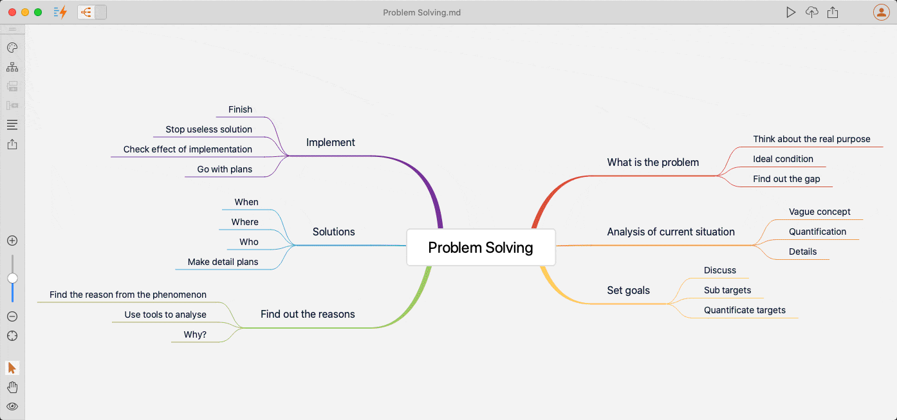

# Version 1.3.8 (stable)

This is a minor update based on 1.3.7.

In this version, we improved the Mind Map drag-and-drop user experience to be more natural and pleasant.

When we drag a Mind Map node to a different place, it will automatically suggest where can be dropped. It could be put above another Mind Map node, below a different Mind Map node, or moved under another Mind Map topic as a child.

When you want to move a Mind Map node into another node, you can drag the node to a place nearby the target node, or you can simply drog it on the target node.

It does not just restructure the Mind Map itself, but it also restructures your document, which makes it very handy for you to review the logical structure of your documents and make changes from the Mind Map quickly. Essentially, the Mind Map view displays your documents' outline.

You can also edit content sections of Mind Map nodes easily, by clicking the `Edit` icon when you move your mouse over a Mind Map node.

You can layout your Mind Map leftward, rightward, upward, downward, or use the standard one. The same drag-and-drop applies to all layouts. Whenever possible, we will keep improving until it's perfect.