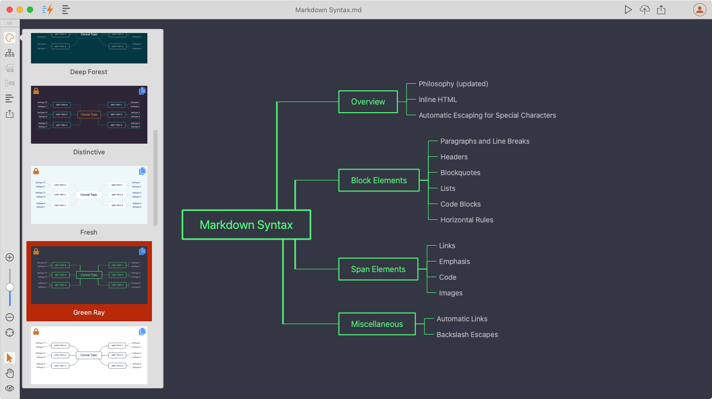

# Version 1.3.9 (stable)

## 15 Built-in Mind Map Themes

We added lots of more Mind Map themes in this version, and now we have 15 built-in themes in Document Node.

To change a Mind Map theme, click the 'Theme' icon on the toolbar, and then select a different one from the list of theme thumbnails.

## Mind Map Theme Customization

We believe that when we concentrate on the content, we shouldn't care about the styles and themes. Unlike most of the Mind Map software, themes can be managed separately in Document Node, instead of allowing users to change style properties of each node.

It's never been easier to create a new Mind Map in Document Node. We just need to change a few properties in a small JSON file. Please the demonstration below.

<iframe src="https://player.vimeo.com/video/421770698?autoplay=1&loop=1&autopause=0&muted=1" width="640" height="360" frameborder="0" allow="autoplay; fullscreen" allowfullscreen></iframe>

## Miscellaneous Improvements & Fixes

* Improved the image thumbnails popup which now can be resized to the whole screen
* Fixed an issue that it couldn't be launched on macOS from Dock if users kept Document Node on Dock
* Fixed color issues of hyperlinks in About dialogue
* Simplified the Mind Map switcher button to just use an icon
* Improved the experience of drag-and-drop on Mind Map further to detect potential parent node automatically and show a more straightforward inserting indicator
* When taking a screenshot, show upper case in the color HEX, and show RGB value additionally
* Right-click to copy color values when taking a screenshot
* Fixed a translation issue of the 'Insert Screenshot' tooltip
* When taking a screenshot, don't show the pixel preview popup inside the selection region whenever possible
* Fixed an issue of displaying iframes on the preview page