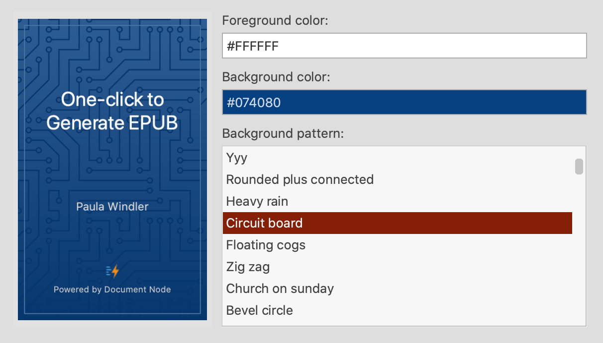
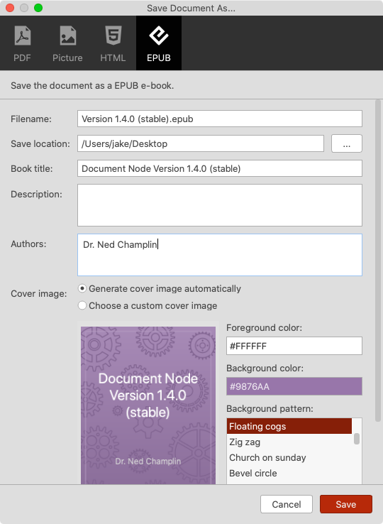
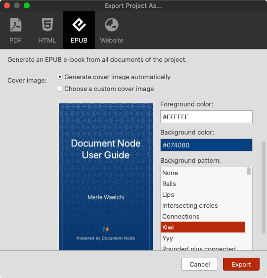
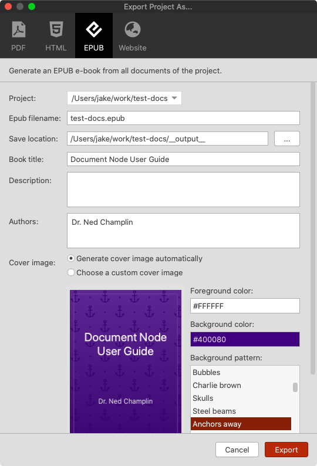
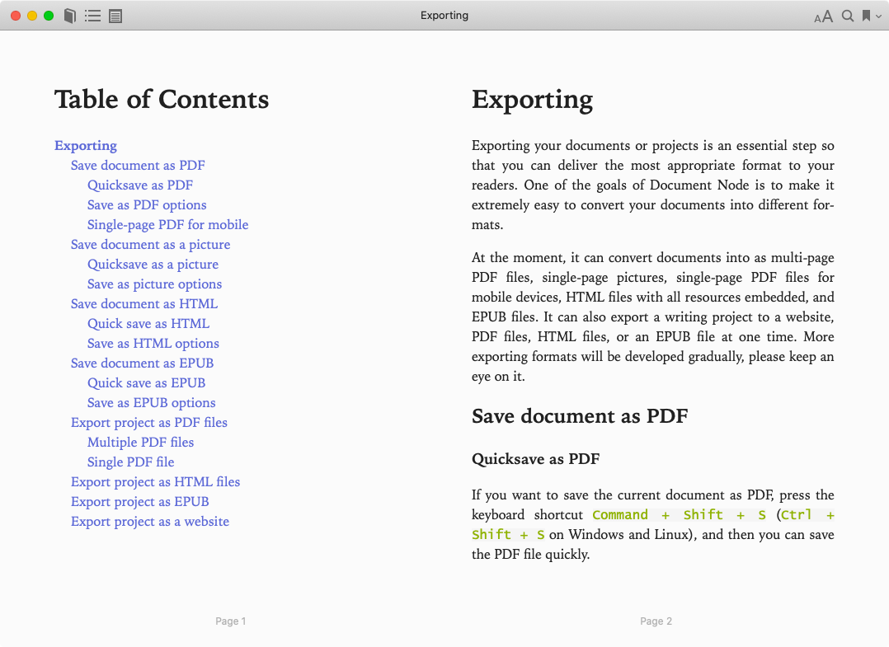

# Version 1.4.0 (stable)

## One-click to Create Epub From Documents

EPUB, short for electronic publication, is a popular file format used for storing eBooks, which can be read on most smartphones, tablets, and computers.

From this version, we can generate Epub files from one or more documents in Document Node easily.

A document can be saved as an EPUB file directly. In the "Save Document As" dialogue, select the "EPUB" tab, fill in the details of the EPUB file, and click "Save".

* **Filename**: The EPUB file name
* **Save location**: The directory where the EPUB file should be saved
* **Book title**: The EPUB book title
* **Description**: The description of the EPUB book, which can be input as multiple lines
* **Authors**: Multiple authors are separated by line breaks; last name and first name is separated by a comma
* **Cover image**: Document Node can generate one for you automatically or use a custom image you provide.

If the current document contains any internal links, the linked documents will be included in the EPUB automatically.

Similarly, we can export an EPUB file from all documents of a project. The order of documents will be kept, and the documents marked as "Draft" or "Unlisted" will be excluded.

Once the EPUB file is created, you can open it using any EPUB readers on your device.

## Miscellaneous Improvements & Fixes

* Don't activate the progress message popup constantly so it won't interrupt users' other activities
* Fixed a font-weight issue in PDF files exported from documents
* Under the Mind Map standard layout, the order of subtopics on the left side tree should be from top to bottom
* Fixed a style issue on Feedback dialogue
* Improved the 'Project Exporting' icon to be different from the 'Save as' icon
* Fixed duplicate results in the full-text search popup
