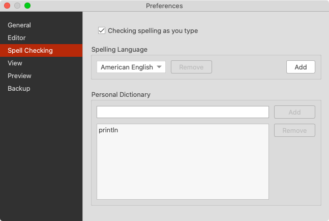
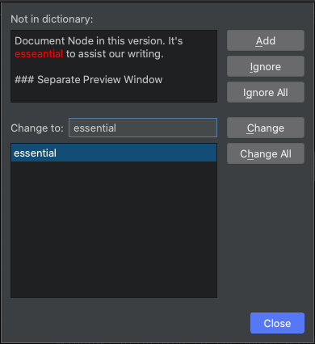
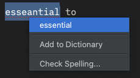
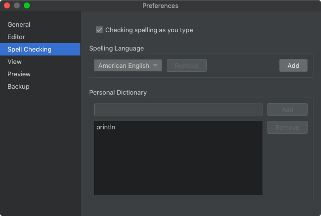
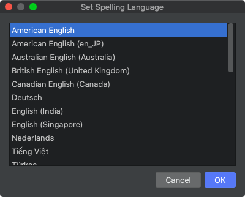
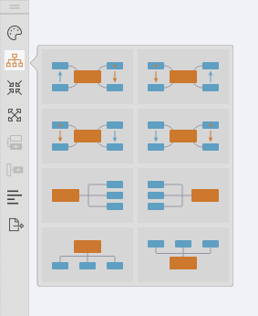
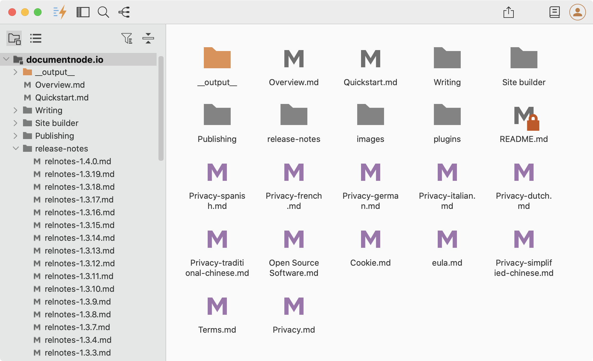
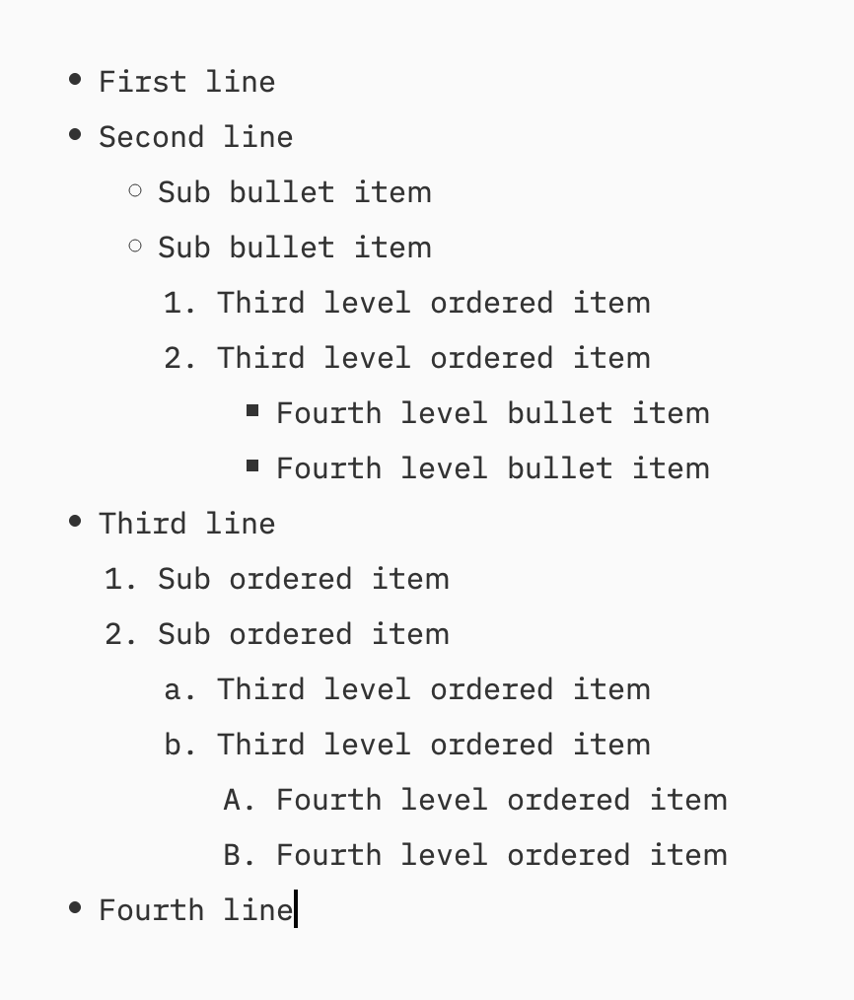
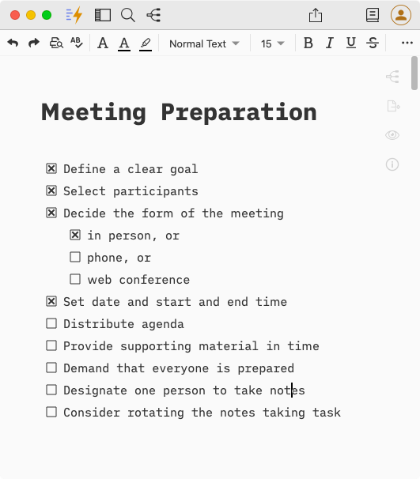

# Version 1.4.1 (stable)

## Spell Checking

We've finally added the feature of spell checking in Document Node in this version. It's essential to assist your productive writing.

All misspelled words will be underlined in red. Right-clicking on a misspelled word, it will show available suggestions.

By default, the system language will be used for spell checking if it's supported. Otherwise, the default language will be set to **American English**. To configure a different language, please go to `Preferences` -> `Spell Checking`, and select a new one.

Alternatively, you can select the application menu `Tools` -> `Set Spelling Language...`, then set the default spelling language in the dialog opened.

## New Mind Map Layouts

We received feedback from a user regarding a different reading direction on a Mind Map. To make it more flexible and easier to use, we added a few more layout options:
* Clockwise
* Counter Clockwise
* From Left to Right
* From Right to Left

Selecting one of the layouts, the Mind Map view will update accordingly.

## Separate Preview Window

The real-time preview has been put into a separate window, attaching to the main window automatically. It becomes optional and more flexible. We can simply toggle it on and off through the preview icon at the top right corner of the text editor.

The main text editor becomes cleaner and easier to use. When we want to focus on writing, we can close the preview window, and it disappears completely.

## Folder Listing Page

As requested by a user, we implemented a folder listing page in this version. When clicking on a folder on the left side, all items of the folder will be listed on the right side.

Double-click a folder or file item to open it.

## Multi-level Lists in Rich Text

As requested by a user, we improved the rich text editor to support arbitrary multiple levels of lists.

Press `TAB` key to increase the level of a list item; press `SHIFT + TAB` keys to decrease the level of a list item.

## Format Options in Rich Text

More format options are enabled for the Rich Text editor, which includes:

* `Format` -> `Blockquote`
* `Format` -> `Inline Code`
* `Format` -> `Underline`
* `Format` -> `Mark`
* `Format` -> `Big Size`
* `Format` -> `Small Size`
* `Format` -> `Superscript`
* `Format` -> `Subscript`
* `Format` -> `Ordered List`
* `Format` -> `Unordered List`
* `Format` -> `Task List`

## Task Lists in Rich Text

Task lists are now supported in Document Node. Select the menu `Format` -> `Task List` to create a task list item from the current line.

It becomes super easy to create checklists in your documents.

## Miscellaneous Improvements & Fixes

* Fixed an issue that prevents moving one folder into another on Windows
* There was an **significant lag while typing** sometimes on macOS retina screen; we've found the root cause and **fixed it**
* Fixed a text color issue in the dark theme of the Mind Map section editor
* Fixed the issue that documents with no headings failed to be included into the generated EPUB file
* Fixed the wrong cover image background when quick-save a document as EPUB
* Improved errors handling while renaming, moving, or copying files/folders on Windows
* Prepended text of a Markdown table should be kept after editing in the dialogue
* Created a new application menu `Tools` to arrange relevant menu items in it
* Fixed an issue that the cursor doesn't sync when switching from text to Mind Map
* Improved tree branch icons and the project tree icon
* Pressing `Enter` key on an empty list item at the end of a list should create a new empty line after the list
* Fixed an HTML output file path issue when generating EPUB
* Fixed the shortcut issues of Find (`Ctrl + F`) and Replace (`Ctrl + H`) on Windows
