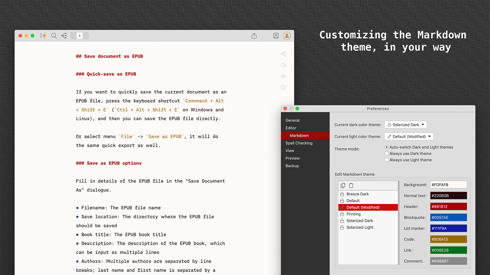
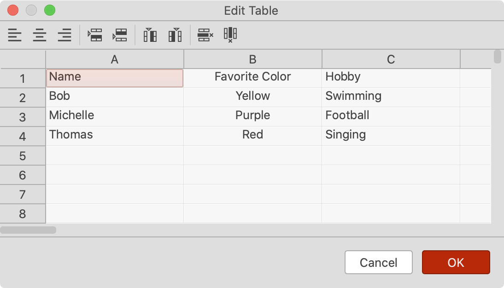

# Version 1.4.3 (stable)

## Markdown Theme Customization

Good news for the users who have asked for the Markdown theme customization! From this version, we will be able to change the editor background and text colors.

Built-in Markdown themes are read-only, but we can duplicate a system theme and then edit the colors as needed.

We have added a couple of new built-in Markdown themes as well.

## Smarter Scroll Bar Sync

Previously, when a document became longer, the synchronization between the text editor and the preview area often mismatched.

In this version, we have rewritten the algorithm and made it smarter based on the current section. Now it's a more pleasant experience when you scroll the text editor and preview at the same time.

## More Flexible Preview Window

In the last version, we experimented with a separate preview window. Some users love the idea because we can easily move it away to a different location, but it also brings some problems of having to manage multiple windows.

In this version, we improved it further. By default, the preview area will sit with the text editor side by side inside the main window.

From there, we added a new "Pop out" icon on the top left of the preview panel. When we click the icon, the preview area will be popped out into a new window. When we want to put it back to the main window, just click the icon again or close the separate preview window.

## New Table Editing Toolbar

A new toolbar is added to the Markdown table editing dialog, to make it easier to use.

The same actions are available in the context menu as well.

## Moved 'Focus' Menu Items

The "Focus Mode" menu items have been moved under the "View" menu, and the "Keyboard Sound" menu items have been moved under the "Edit" menu. Therefore, no need to have a top level "Focus" menu anymore.

The application menu bar becomes simpler and cleaner.

## Miscellaneous Improvements & Fixes

* Removed 'Tools' menu which is unnecessary, and moved 'Preferences' back under 'File' menu
* Selecting an item on a folder listing page also selects the same item on the left project tree
* Improved the display of Quick Inserting toolbar on the Mind Map section editor
* Show an empty preview thumbnail in the Inserting Image popup if no images found in the current project
* Hide the scroll bar of the text editor when it's not needed
* Improved the user experience of sending feedback
* Fixed `Select All` shortcut issues for the Appearance Editing dialog, Mind Map Theme Editing dialog, Preview Style Editing dialog, and View Page Source dialog
* Fixed the icon color issue of combo box in dark mode
* Remember the main window layout on App restart
* For convenience, we added new menu items 'Create Empty Project', 'Open Folder as Project', and 'Clone Project from Git' to the context menu of projects pane
* Fixed an overlapping of Mind Map in 'Counterclockwise' and 'From Left to Right' layouts
* Fixed an issue of not being able to update the root node without heading in Mind Map
* Added a new 'Reload' menu item in the context menu of the preview pane
