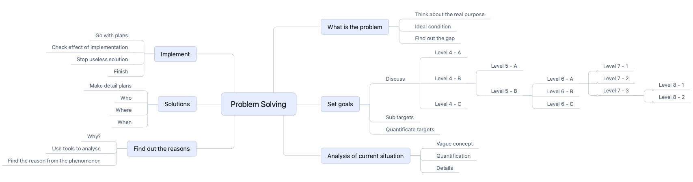
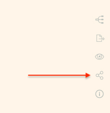
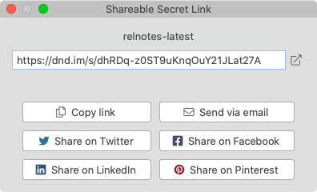

# Version 1.4.4 (stable)

## New Features in Mind Map

### Arbitrary Levels in Mind Map

Both the headings and bullet list items will be treated as Mind Map nodes, which enables us to have arbitrary levels of nodes in a Mind Map.

Of course, you can choose to only use headings or bullet list items in your document as a way to create Mind Map in an open format.

### Cut/Copy/Paste in Mind Map

In this version, we have added the `Cut/Copy/Paste` in the Mind Map view. Mind Map nodes can be cut, copied, and pasted. Also, any text or HTML in the clipboard can be pasted as a new child node of the selected node.

### Expand/Collapse Selected Node in Mind Map

After we select a node in a Mind Map, press `Cmd + R` (`Ctrl + R` on Windows and Linux) to switch amongst the below expanding/collapsing statuses:

1. Collapse the selected node completely
2. Expand the selected node to its children level only
3. Expand the selected node completely

This is a convenient way to help us stay focused and/or see the branch content.

### Show Mind Map and Editor Side-by-side

We improved the UI layout to make it possible to easily see both the document and Mind Map at the same time.

Click the "Mind Map" icon on the top bar to switch to the Mind Map view of the current document in a full window. Now the three-column layout is also available, where we can show the text editor or projects tree by showing the central panel and left panel.

## Shareable Secret Link

### Shareable Secret Link for Document

As requested by some users, we've added a feature to share documents quickly with others by using a shareable secret link.

Click the "Shareable Link" icon from the top right corner of the text editor to generate a shareable secret link.

The link can be shared through multiple channels via a simple click.

### Shareable Secret Link for Mind Map

Similarly, click the "Shareable Link" icon on the Mind Map toolbar, we can get a secret link so that you can share your Mind Map with others.

## Miscellaneous Improvements & Fixes

- Fixed an issue of background and text color in the line numbers area, which happens when we change the Markdown editor theme
- Added a new option in `Preferences` -> `General` to enable or disable `Start Document Node on system startup`
- Fixed an issue of not being able to copy a folder into its parent folder with a new name
- Added a new property `lineRightAngleRadius` to the Mind Map theme customization JSON file to customize the radius of the `RoundedRightAngle` line style
- Added a new built-in Mind Map theme `Concise Blue`
- Fixed an issue of not being able to edit the root node of Mind Map when it's created from the file name
- Automatically import images when copying content from MS Word or LibreOffice
- Fixed the folder listing page layout issue that happened occasionally
- Fixed issues when renaming the project display name
- Fixed a text color issue in the Mind Map section editing popup when it's in dark theme
- Fixed preview scrolling issues when the window state is changed (e.g. minimized or maximized)
- Fixed styling issues of sliders in preferences dialog and Mind Map toolbar
- Fixed color issues of the current line highlight and scroll bar in the text editor
- Added an option to customize the background color for the line of the current text cursor

## Features Planned in Next Version

If you haven't seen your favorite features in this version, they will probably be included in the next version. We have planned the following features in the next version. Please stayed tuned.

* Multi-selection restructuring in Mind Map
* Exporting documents as DOCX
* Add sorting options in the projects tree
* Jump links, internal links, and backlinks
* Snap package for Linux distribution
