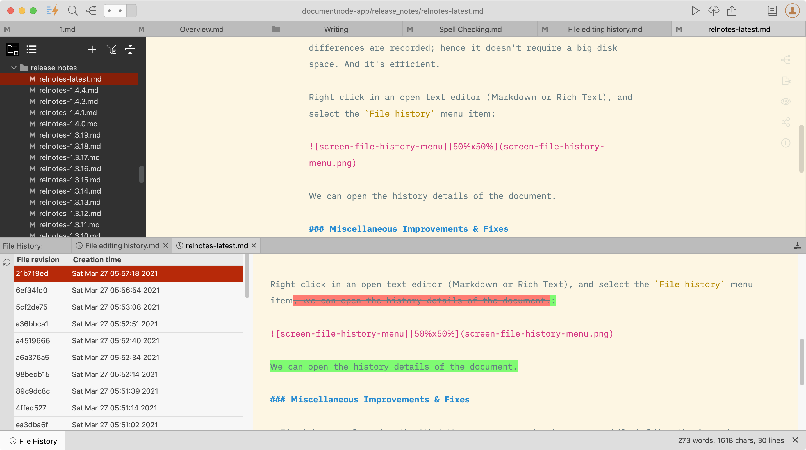
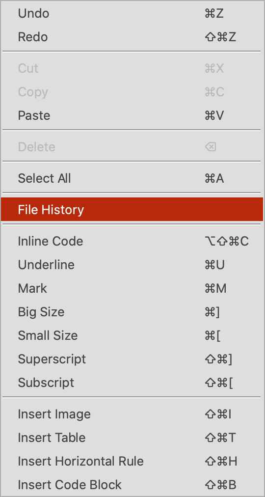
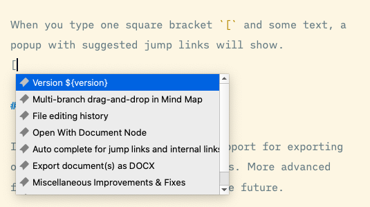
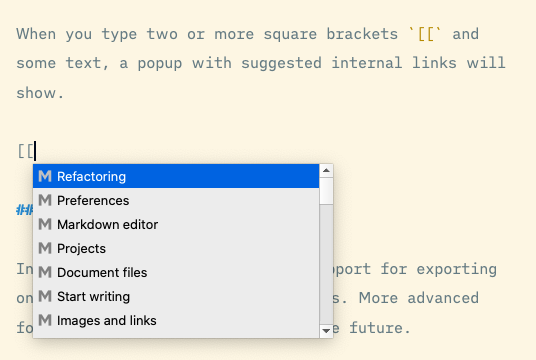
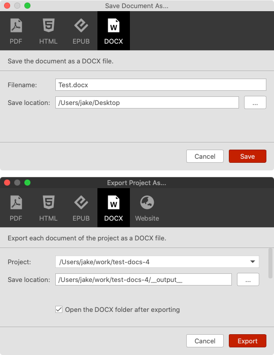

# Version 1.4.5 (stable)

## Multi-branch drag-and-drop in Mind Map

As some users requested, we added a new feature to allow drag-and-dropping multiple branches in Mind Map.

Select multiple nodes while holding your `Command` key (`Ctrl` key on Windows and Linux), or just drag your mouse to select nodes with the rubber band, then you can move them to a different location.

It's never been easier to learn your content by transforming it into a non-linear Mind Map view.

## File editing history

Have you ever tried to find an old revision of your document? It's extremely useful if we have the full editing history of documents. By navigating to different file revisions created at different times, we can explore how our thoughts have changed.

Besides, full editing history is also a great backup.

In this version, we have developed a feature in Document Node to support the full editing history. Any changes in a document will be recorded to build a full history of it. Most times, only revision differences are recorded; hence it's efficient and doesn't require big disk space.

Right click in an open text editor (Markdown or Rich Text), and select the `File history` menu item:

We can open the history details of the document.

Select a revision on the left table, the file content of the selection revision will be opened on the right-side text editor.

## Open With Document Node

In this version, we added support for **file type association** with Document Node on macOS and Windows. 

It's quick and easy to double-click a Markdown file and open it in Document Node.

## Auto-complete for jump links and internal links

Interconnection within a document and between multiple documents is important for building a knowledge base or other writing projects.

As a first step, we added auto-complete support for **jump links** and **internal links** in this version. Jump links are links that jump between sections within the same document. Internal links point to other documents in the same writing project.

When you type one square bracket `[` and some text, a popup with suggested jump links will show.

When you type two or more square brackets `[[` and some text, a popup with suggested internal links will show.

Select a link and press `Enter`, the link will be inserted into your Markdown editor automatically.

## Clickable links in Markdown editor

All links, including jump links and internal links, are clickable in the Markdown editor and preview page.

In the Markdown editor, when you hold the `Command` key (`Ctrl` key on Windows and Linux) and click a jump link, the text cursor will jump to the corresponding section of the current document. Similarly, when you hold the `Command` key (`Ctrl` key on Windows and Linux) and click an internal link, the linked document will be opened.

All links, including jump links and internal links, are also clickable on the preview page.

## Export document(s) as DOCX

In this version, we added basic support for exporting one or more documents as DOCX files. More advanced formatting will be supported in the future.

More advanced formatting will be added in later versions, such as:

* Links
* Bullet lists
* Ordered lists
* Tables

Please stay tuned.

## Miscellaneous Improvements & Fixes

- Fixed issues of moving the Mind Map canvas around using a mouse while holding the Space key on Windows and Linux
- Improved drag-and-drop in Mind Maps to be more accurate
- Fixed an issue of current line highlighting in the Mind Map section editing popup
- Fixed Mind Map section editing popup issues occurred when subsections detected
- Improved the file renaming to allow renaming from upper case to lower case, vice versa
- Improved the project renaming dialog to not auto-suggest a new name directly. Instead, a new checkbox option will be used
- Added **rubber band multiple-selection** in Mind Map
- Fixed "Move Up" and "Move Down" issues in the context menu of the outline page
- Added support for setting a default Mind Map theme
- Added built-in help to display for new users
- Fixed an issue when clicking on a document file link  on the preview page, which should open the file in the text editor
- When headings and bullet items start with inline code, they should be shown correctly in outline and Mind Map
- Fixed an app crash issue when saving PDF using the preview style from the preview pane
- Improved the web preview component on macOS and reduced the installation file size of macOS from 44 MB to 25 MB
- Fixed a potential app crash in the App Store sandbox environment

## Features Planned in Next Version

If you haven't seen your favorite features in this version, they will probably be included in the next version. We have planned the following features in the next version. Please stayed tuned.

* Add sorting options in the projects tree
* Clean and elegant display of internal links and backlinks
* Allow creating tags and navigating using tags easily
* Snap package for Linux distribution
