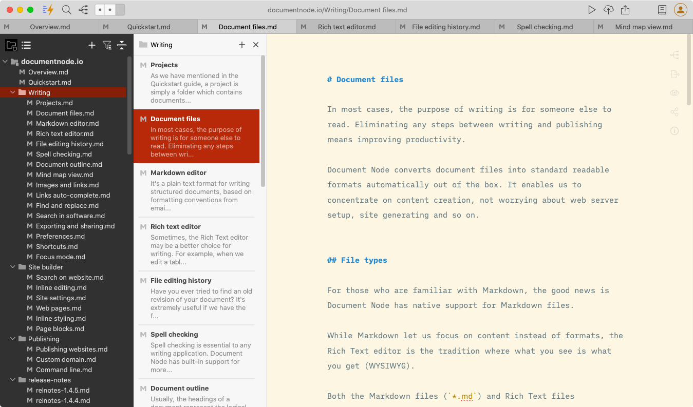

# Version 1.4.6 (stable)



## Document List View

Instead of listing icons of a folder, we developed a document list view to show summaries of documents. As shown in the cover image, we can quickly navigate and preview the documents in the same folder.

The document list view can be closed if we don't need it. Clicking on a folder on the left side will open the list view again.

## Linux Snap Store

We have published the latest version to the [Linux Snap Store](https://snapcraft.io/documentnode).

Now **Document Node** can be easily installed using the command line:

```bash
sudo snap install documentnode
```

The [Linux Snap Store](https://snapcraft.io/documentnode) version needs *zenity* to open external files in the app. Please install via `sudo apt install zenity` if you don't have *zenity*.

From now on, each new version will be published to the [Linux Snap Store](https://snapcraft.io/documentnode) as well. Linux Snap users will be able to get the updates quickly and easily.

## Microsoft Store

The latest version of Document Node has also been published to the [Microsoft Store](https://www.microsoft.com/en-au/p/document-node/9phbjj3l6d7w).

From now on, any updates will be published to the [Microsoft Store](https://www.microsoft.com/en-au/p/document-node/9phbjj3l6d7w) as well.

## Miscellaneous Improvements & Fixes

- Fixed an issue that the preview should be hidden when taking a screenshot on macOS
- Fixed issues of **updating preview** on macOS
- Fixed **images flickering issues** on the preview pane
- Improved the document section location scrolled to when a heading is selected from the outline pane
- Fixed the Mind Map icon state issue on Windows and Linux
- Fixed an issue that clicking `mailto:` links in the preview pane should open the default mail app

## Features Planned in Next Version

If you haven't seen your favorite features in this version, they will probably be included in the next version. We have planned the following features to be developed soon. Please stayed tuned.

* Edit documents in separate windows
* Clean and elegant display of internal links and backlinks
* Allow creating tags and navigating using tags easily
