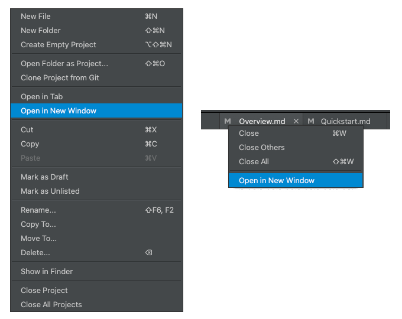

# Version 1.4.7 (stable)

## Go back and forward 

When working on multiple documents at the same time, we often want to go back to the previous editing locations. Going back or forward allows us to manage our writing flow easily.

In this version, we added two new buttons (`Go back` and `Go forward`) on the main toolbar. Clicking these buttons to go back/forward among the editing locations. The corresponding shortcuts are `Cmd + Alt + Left / Right` on macOS, and `Ctrl + Alt + Left / Right` on Windows and Linux.

The history of editing locations is saved on disk, which means when we restart the application, the history of editing locations is still available.

## Edit document in new window

Many users have requested a feature of editing documents in separate windows. It makes it easy to edit one document from another, or when you want to view other part of the document you are working on. 

For example, when you summarize what you have written, you would definitely like to see what you have already written earlier, which is located above or below the current text cursor.

We have developed this feature in this version. A document can be opened in new separate windows from the left projects tree, or from the tab bar.

You can open as many new document windows as you like. The preview pane will show the content of the active window.

## Miscellaneous Improvements & Fixes

- Fixed background issues in the `Edit Preview Style` dialog
- Fixed a preview sync issue for Windows and Linux

## Features Planned Next

If you haven't seen your favorite features in this version, they will probably be included in the next version. We have planned the following features to be developed soon. Please stayed tuned.

* Clean and elegant display of internal links and backlinks
* Allow creating tags and navigating using tags easily
