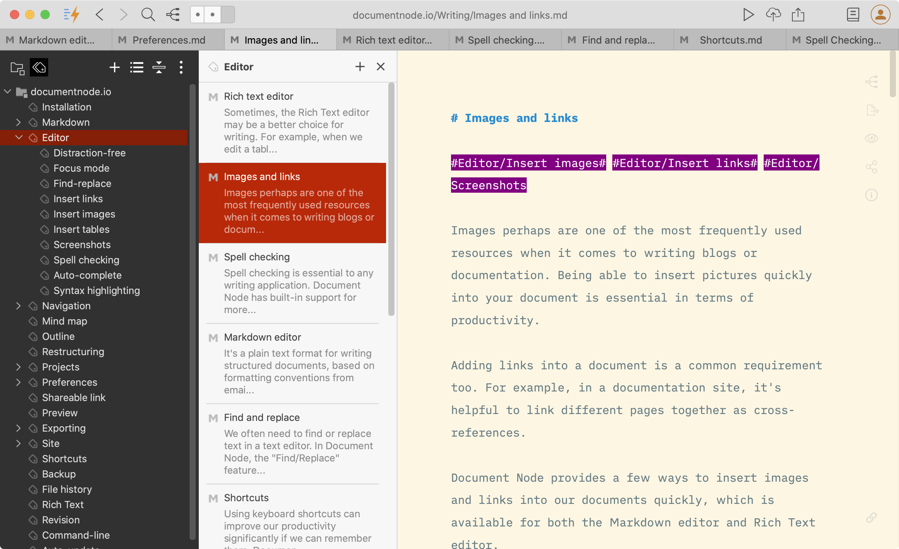
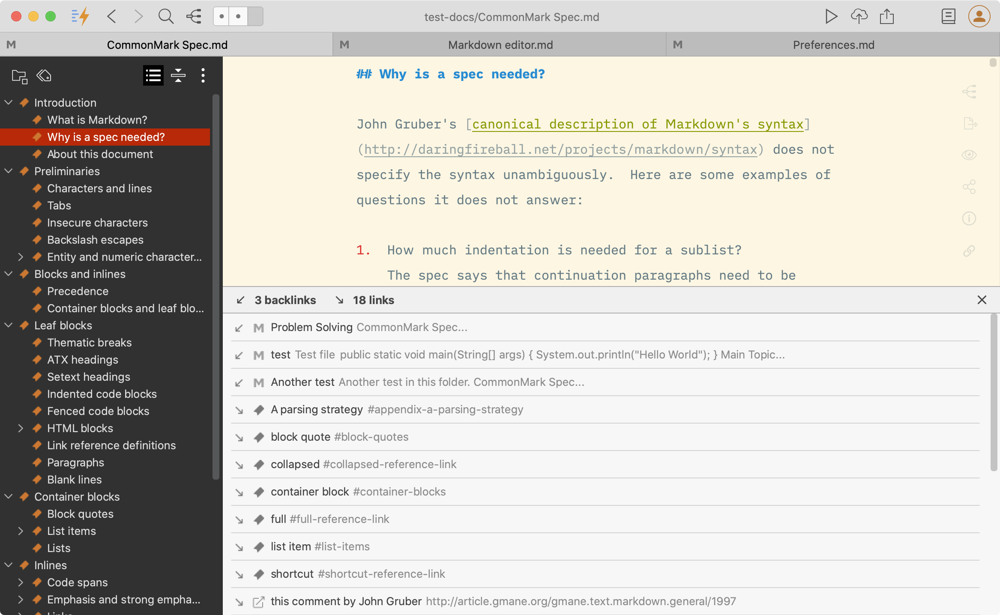

# Version 1.5.0 (stable)

## Flexible Tags 

We're excited to introduce the new feature of tagging in this version.

In addition to folders, tagging is the most important way to organize your documents. Being able to rename and restructure your tags gives the maximum flexibility so that you can keep your tags up-to-date at any time. In Document Node it's simply done via drag-and-drop.

Here are some quick tips about how they work:

* A tag is just a word with a pound sign
* You can add multiple #tags anywhere in a document, separated by a space
* **Multi-word tags** are wrapped in hashtags, like #overseas travel#
* Quickly add existing tags with **auto-complete**
* **Tags View** on the left sidebar allows you to filter all documents having that tag
* Infinite **nested tags** by slashes, like #Journal/2021/06 - this means #Journal will be the **parent tag** in Tags View
* Easily **refactor the tags tree** in Tags View (renaming, deleting, or moving around by drag-and-drop)

## Backlinks

Bi-directional links interconnect your documents together. We have developed backlinks and links in this version.

Click the "Link" icon in the bottom right corner of the text editor, all backlinks and links will be listed below the text editor.

Specifically, the following links of the current document will be listed.

* **Backlinks** - the documents which are pointing to the current document
* **External links** - web links etc.
* **Document links** - other documents that the current document is pointing to
* **Jump links** - the jump links within the current document

Click each link, and it will jump to the linked resource accordingly.

## Miscellaneous Improvements & Fixes

- Fixed issues of inconsistency between the status bar and the view menu
